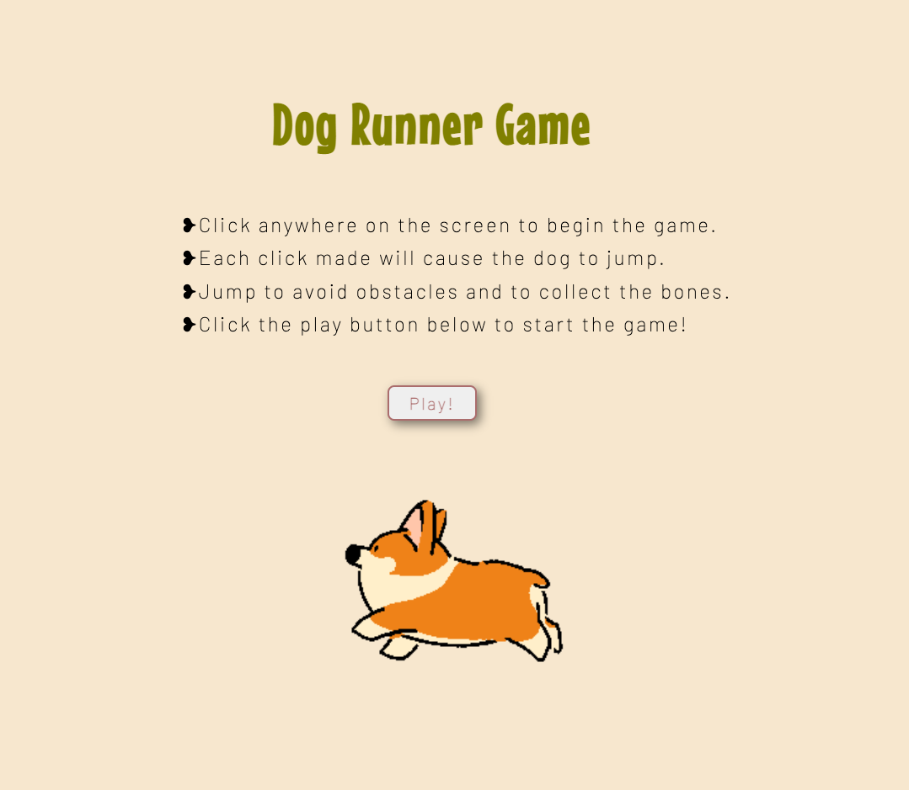
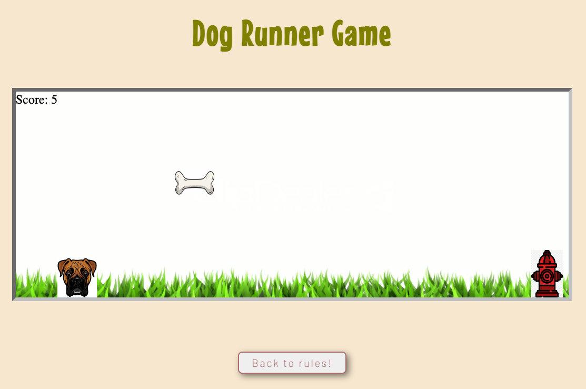

# Dog Runner Game

## Date: 07/01/2022

### By: Anaflavia Almendras

#### [GitHub](https://github.com/A-Almendras) | [LinkedIn](https://www.linkedin.com/in/aalmendras/)

---

---

### **_Description_**

#### Dog runner is a browser game where the dog should be able to collect bones by avoiding obstacles when presented. The dog will keep running until it collides with a barrier.

---

### **_Technologies_**

- Languages: HTLM5, CSS, Javscript

---

### **_Getting Started_**

##### The game will directly prompt the player to the main page, where it will describe how to play the game. Once ready, the user will click on the play button which will redirect them to the actual game. The player can initiate the game with a click anywhere on the screen, and this will cause the obstacle to begin sliding towards the dog. The player must determine when to click the page to activate the jump to either collect a bone or avoid the fire hydrant obstacle. If the dog's jumping time is off, it may collide with the obstacle causing the player to lose the game. Timing the jumps is key to achieving a high score. A button was also included below the game to redirect you back to the main page in case you forget the rules.

##### A Trello board was used to keep track of development progress and can be viewed [here](https://trello.com/b/axD6qkG5/project-1-dog-runner-game).

---

### **_Screenshots_**

#### **Main Page**

#### **Game Page**

---

### **_Future Updates_**

- [ ] To generate obstacles and rewards randomly
- [ ] To utlize sprites for dog movement
- [ ] To create a game over/replay pop up.
- [x] To implement score board for bones collected

---

### **_Credits_**

- [MDN Search](https://developer.mozilla.org/en-US/)
- [W3Schools](https://www.w3schools.com/)
- YouTube
- Stackoverflow
